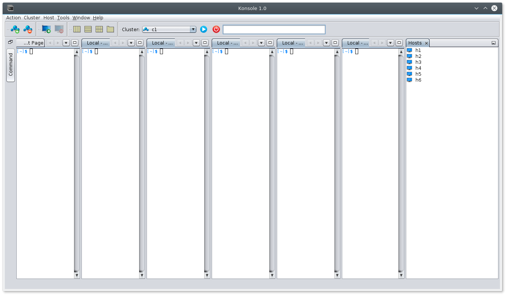
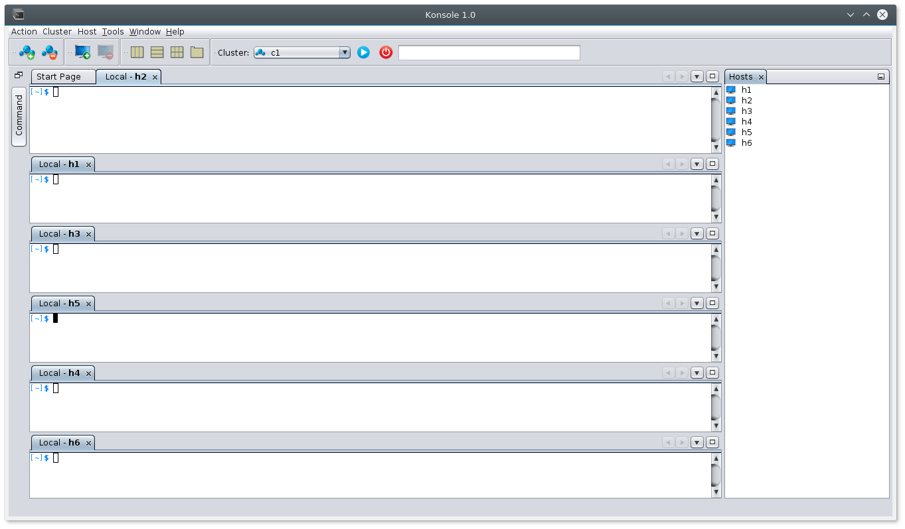

<html> 
    <body>
    

        <h1>JSSH</h1> 
    

    
JSSH allows you to open terminals to multiple hosts. It allows you to tile them in different modes. It also saves your configuration and provides a name space (cluster) to group the machines.

    
<b>Project Page:</b> <a href="http://pragalathanm.github.io/jssh">http://pragalathanm.github.io/jssh</a>

     
    
Install the following plugin to enable tilling of windows in multiple positions using simple clicks. Below are the steps to install the plugin.

    <ul>
        <li>Click <a href="http://plugins.netbeans.org/plugin/56815/tiled-editors">here</a> to download the plugin. Save the plugin to your system</li>
        <li>Go to <b>Tools->Plugins->Downloaded->Add Plugins</b>. Select the downloaded file.</li>
        <li>Click 'Install'</li>
        <li>If it is installed successfuly, you will see a yellow color buttons in your toolbar as shown below.</li>
    </ul>
    
Tab View:

    
Vertical Tiles:

    
Horizontal Tiles:

    
Matrix Tiles:

    
Add a cluster and then add hosts. You can also add multiple hosts (comma separated or space separated) in one go. 
        Once host is added you will be able to associate a name with each host by going to <b>Window->IDE Tools->Properties</b> and select a host from host window and edit its name in properties window.

    

    <h2>Build</h2>
    You need the following software to build the project locally.
    <ul>
        <li>Netbeans 8.0.2. Higher versions have dependency issue. 8.0.2 can be downloaded from <a href="https://netbeans.org/downloads/8.0.2/">here</a> </li>
        <li>Java 8.0+</li>
    </ul>
    Checkout the code and open the project in Netbeans. You are good to go.
    <body>
</html>

